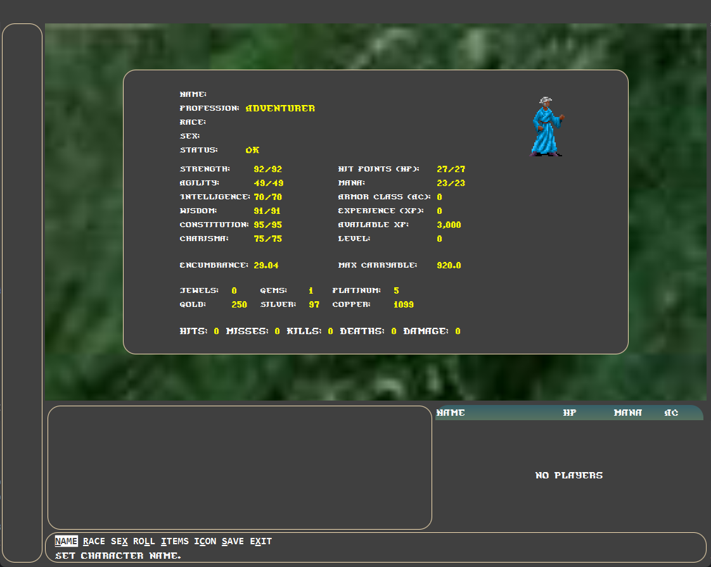
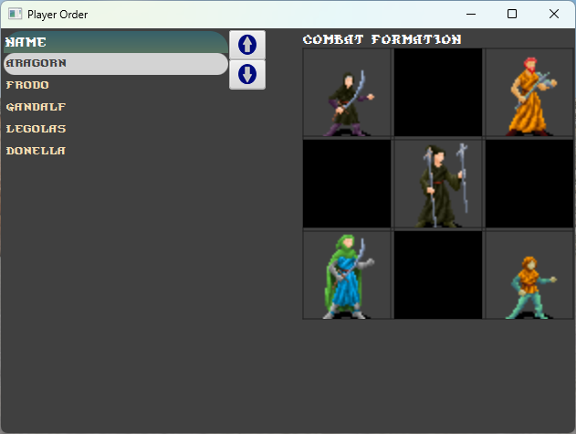
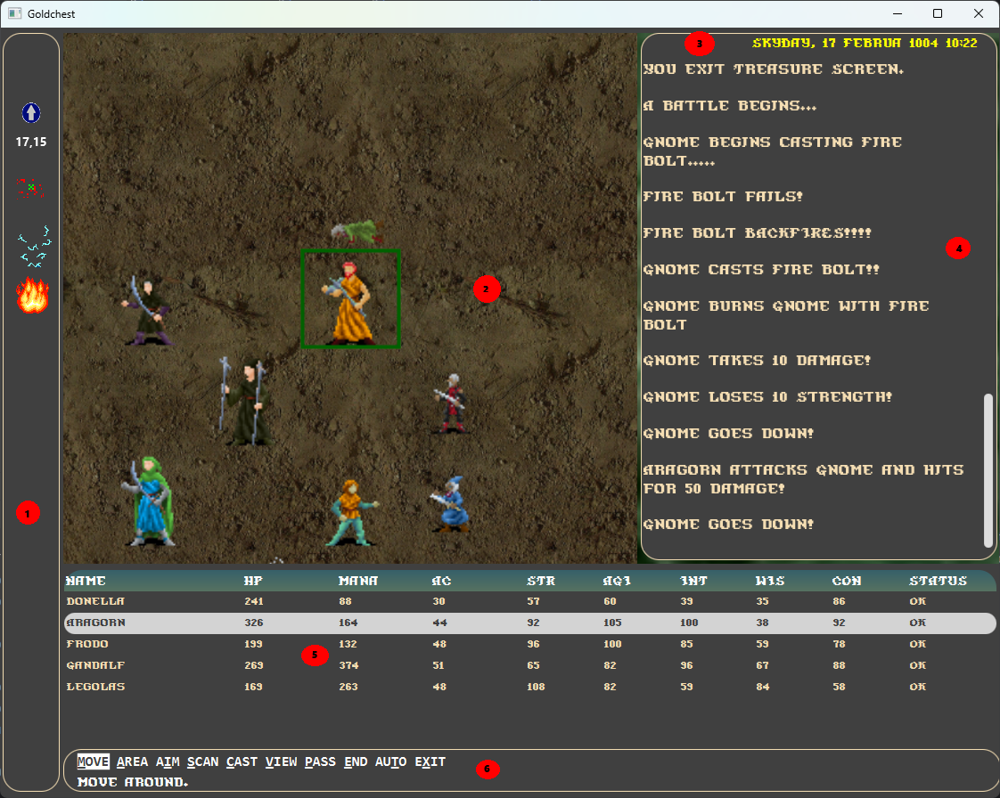
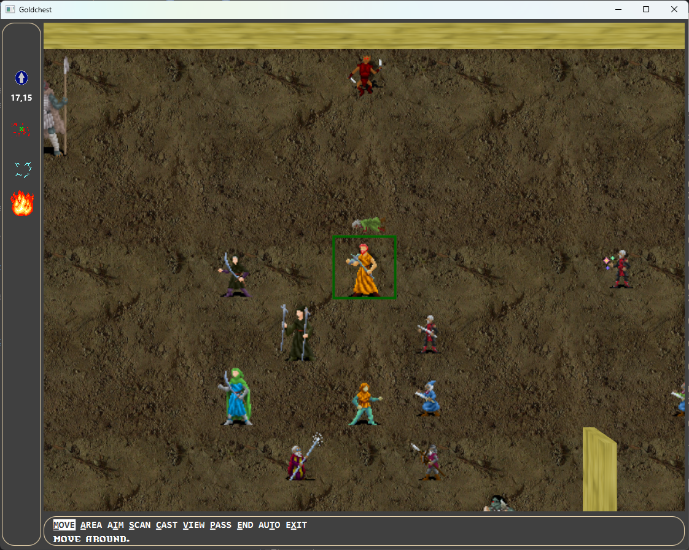

# Goldchest whatever title this will be

## Introduction

blah blah blah

Blah features up to 9 party members (6 is usual to allow for NPCs in the party). Tactical combat.
2 distinct magic systems, experience for exploration,

## Characters

### Races

#### Human

While possibly being of hardier stock, this character is nonetheless like you or me.

#### Elf

Patterned after the Tolkien elf, the elf is slight of build, frequently taller than a human, and
very inclined to magic.

#### Dwarf

The Dwarven people are short and stout, extremely strong and healthy, but not amazingly
intelligent.

#### Hobbit

Hobbits (Halflings) are slightly smaller than Dwarves but are nimble and dexterous.

#### Half-Elf

These cross breeds are usually blond and fair-skinned, like elves, and gel some added
size and strength from their human ancestry.

#### Gnome

Gnomes closely resemble dwarves, but have less hair and even shorter tempers. They are
also more magically inclined, as a rule.

## Classes

#### Fighter

Fighters can use any weapons or armor. They gain an extra attack every 3 levels.

#### Cleric

Holy crusaders eschew edged and ranged weapons, preferring blunted maces, staffs or hammers.
They can wear any armor and gain an extra attack every 4 levels.
Clerics seek out holy places to learn wisdom giving them holy powers of healing
and powers against the undead.

#### Thief

This highly versatile profession can be proficient with any weapons but is limited to
lighter armor since they need their dexterity for shoplifting, pick pocketing, looting, infiltration
and unlocking/disarming treasure chests. They gain an extra attack every 4 levels.

#### Mage

Acolytes of the mystic arts are limited to one handed swords, daggers, staffs and slings and can't
usually wear most armor since they need dexterity for their spell casting.
While they only gain an extra attack every 5 levels, they compensate with magic spells.

### Character Statistics

#### Hit points

Measures the damage a character can take before they are down.

#### Mana points

Represents the current mental power of the character for spell casting and using skills.

#### Level

The general level of your character. Higher is better. When you gain a level you also
gain more hit points and mana points.

#### Armor class

Protection based on armor, shields, clothing and magic.

#### Experience points

Experience earned from quests, exploration and fighting monsters. These points can be
spent on gaining levels and learning new skills/abilities.

#### Coins/Gems/Jewels

There are multiple money types in the realm.

- Platinum = 5 gold
- Gold = 1 gold
- Silver = 1/50 gold
- Copper = 1/100 silver

In addition, gems and jewels are worth a significant amount of gold but they require someone to
appraise them for their value in exchange for gold.

Most transactions are done in gold coins.

#### Encumbrance/Max Carryable

Items and coinage have weight in the game. The more stuff you lugs around the more
encumbered you will be. Encumbered characters are slowed down in combat.

### Character Attributes

Each character you create has six primary attributes which define their abilities.
When you create a character each attribute is randomly assigned a value up to 100 which
is equivalent to the maximum human value.

#### Strength

Strength is physical power and chiefly affects the amount of damage a character can do to an
opponent in hand-to-hand combat. Make sure your fighting characters are strong.

#### Agility

Measures general dexterity & nimbleness. A high score makes your characters harder to hit,
and helps them strike the first blow in combat. Magic spells and trap disarming require
good a agility score.

#### Intelligence

Intelligence is mental power. A high intelligence rating will enable your
Magic users to gain more mana for their spells.

#### Wisdom

Wisdom is the character’s enlightenment, judgement, wile, will power  
and intuitiveness. A high wisdom enables your clerics to gain more mana.

#### Constitution

Constitution is the character's overall health affecting hit points gained per level and
their resistance to various substances and magical effects.

#### Charisma

Charisma affects how non player characters might interact with you.

## Character Creation

To create a character in the game, choose CREATE from the startup menu. Specify name, race and sex,
then ROLL until you are happy with the attributes and use ITEMS to chose some start up items for
your new character.

The character ICON is generated randomly but you can change it at any time.

Characters start out as adventures at level zero. You need to find an appropriate place to level up
and receive other training.

## Places

Towns, villages and wilderness areas may contain these places worth visiting.

### Armory

Armories buy and sell weapons, armor and ammunition. The proprietors can identity some items for you as
well - for a price.

### Blacksmith

The blacksmith will buy and sell weapons, armor usually at a better price than the armory but with mixed quality.
The proprietors can identity some items for you as well - for a price.

### Tavern

Visit taverns to hear rumours and recruit NPCs into the party. Don't drink too much though.

### Inn

Inns are safe places to rest in exchange for some gold. Resting restores some hit points and mana.
Resting also give characters time to study new skills and abilities that they've learned at the
various guilds.

### Temple

Temples are divine places of complete healing and where clerics go to study.
Clerics who are worthy may pray here to acquire cleric spells from ancient holy tomes.

### Fighter Guild

Everything you need to know about killing monsters is here.

### Mage Guild

Libraries of everything known about the mystical arts. Proprietors can usually identify magical
items for you.

### Thief Guild

Dens of villainy where scums of the earth plan vicious deeds upon the unsuspecting peasantry.
You thief will feel right at home here.

### General Store

Carries common items useful for adventuring.

### Taylor

Buys, sells and repairs clothing and leather goods.

### Bank

A storehouse for items and money when your characters get too rich to carry everything they have.
When you're poor, you can get loans but be careful to pay them back unless you want concrete galoshes.

### Jeweler

Jewelers buy and sell gems and jewels. They will usually offer you the best price when appraising.

## Combat

While some areas of Goldchest are safe to travel, many areas are dangerous and inevitably
you'll encounter others who would rather you didn't exist in the universe.

When you have an encounter you will usually have 3 options:

FIGHT - Begin combat immediately.

RUN - Attempt to run away. If you fail, combat will begin immediately and possibly 
the monsters will get the initiative.

QUICK - Quick combat runs combat quickly in "automatic" (AI) mode where you have no 
option to interact in the outcome. Players will play in AI mode until monsters or 
the party is defeated. 

*QUICK mode is meant for scenarios where your party encounters monsters that you
have defeated in the past and are fairly sure that that can do so again. It's 
probably not a good idea to use this when encountering new monsters.*  

### Combat initiative

Once combat begins monsters will be laid out in the combat arena, players and
monsters usually start by mostly agility order. This can be different if your
party surprises the monsters you will get initiative and get some moves before the
monsters. On the other hand, monsters may surprise your party and get initiative.
In that case the monsters will get some and get some moves first and it's also
possible that your party will be scattered in combat (not in usual [formation](#combat-formation)).

### Combat formation
                              
Party members can be placed in various positions in a 3x3 grid.

Chose ORDER from the main menu and use drag-drop to place the characters.

You can also change the order the players appear in the game list.

### Combat screen

   
The combat area is divided into sections described below

##### (1) Effects Panel 

The effects panel displays spells or abilities in effect for the selected
character. These may include compass, coordinate, mini-map, etc..

##### (2) Combat Panel

The combat panel displays characters and monsters within a certain area.
Pressing F3 during combat toggles between this view and full combat 
panel view (see [Full screen combat](#combat-full-screen)).
The camera is centered on the selected player or monster. A box around 
the selected player indicates health, green = good, yellow = slightly wounded, 
red = badly wounded.

##### (3) Calendar

This displays the current calendar date and time.

##### (4) Text Panel

The text panel displays details of the action in scrolling text.  

##### (5) Player Panel

The player panel displays players and summoned monsters including their attributes and
status.

##### (6) Menu Panel

If the selected character is user controlled you will see the combat menu.
Use the combat menu to move, select and cast spells, check inventory etc.
The combat menu contains most of what's available normally except trading 
and dropping items (unless you're a thief see ####THIEF?) 

#### Combat Full Screen

 
Press F3 to toggle full screen combat and [normal combat screen](#combat-screen).

#### Automatic moves and Manual moves

(NPCs link) and monsters are generally controlled by the game. Players will usually have
a combat menu with 

fdkjh sfsdf
fsdfsf
fsdf
sfsf
sfsdfs
fsfsdf
